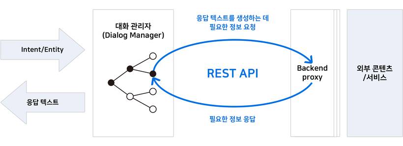
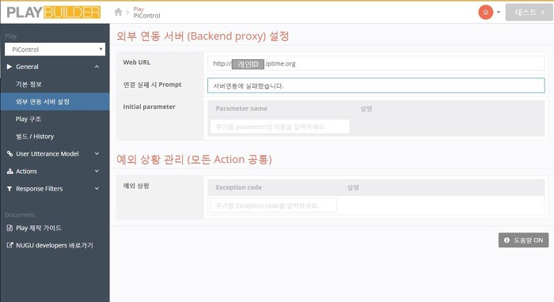
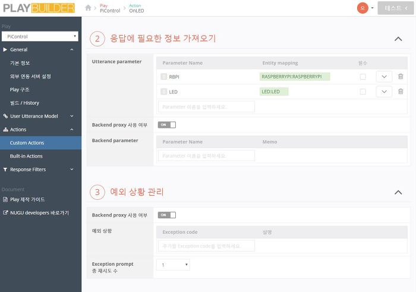
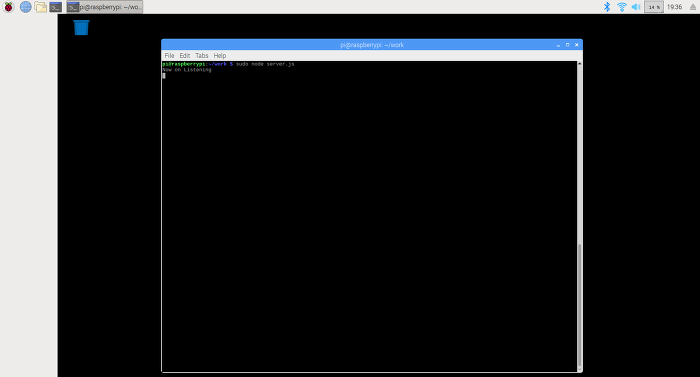

# 누구와 연동될 웹서버 구축하기
NUGU developers에서는 외부 연동 서버(Backend proxy)와 연동되어 필요한 정보를 요청하거나 응답 할 수 있습니다. 
사용자가 NUGU 스피커에 음성 명령을 내리면 NUGU서버는 이 말을 이해하고 플레이 빌더에서 생성된 규칙에 따라 외부서버(라즈베리파이)로 명령정보를 전달 합니다.

동작방식은 REST API 호출
--
Play에서는 사용자의 발화를 분석한 내용을 기반으로 적절한 응답을 내보내 주거나 동작을 수행합니다.



이 응답에 필요한 정보가 외부 서버로부터 가져와야 하는 경우는 REST API를 통해 요청해야 하며,디바이스를 동작시키는 명령을 정의하는 것도 Backend proxy(라즈베리파이)에서 처리해야 합니다.


라즈베리파이에 웹서버 구축하기
--
라즈베리파이는 NUGU서버에서 명령을 받아 GPIO를 제어하게 됩니다. 
즉 라즈베리파이라는 컴퓨터에 명령을 실시간으로 받을 수 있는 웹서버를 구동시켜야 합니다. 
누구 서버에서 명령을 전달 할 고정된 주소가 필요하며 라즈베리파이를 고정 IP에 접속시킵니다. 
필자는 IPTIME 공유기를 사용하여 DDNS로 고정 IP를 설정하였습니다.

   - [아이피타임 DDNS로 고정 IP 서버 구축하기](http://yangarch.tistory.com/108)

다음으로는 자신의 고유 접속주소를 가진 라즈베리파이에 NUGU서버에서 전달된 명령을 받고 처리하는 프로그램을 만들어 넣어줍니다.
필자는 node.js 와 express 로 명령을 받아 수행하는 프로그램을 작성하였습니다. 
하기 예시를 따라하시면 됩니다.

 - [라즈베리파이 node.js 기반 REST API를 이용하여 LED on/off 제어하기](http://vlee.kr/2013)
 
실습하기 (PlayBuilder설정)
 --
위의 예제를 통해 라즈베리파이에 node.js와 express로 라즈베리 파이의 LED를 켜고 끌 수 있다면이제는 NUGU서버와 연동을 진행해 보겠습니다.

- [외부 연동 서버(Backend proxy) 가이드](https://developers.nugu.co.kr/docs/create-plays-with-play-builder/use-backend-proxy.html#use-backend-proxy)



 - 01 외부연동 서버 설정에서 Web URL에 라즈베리파이의 주소(DDNS)를 입력해 줍니다.
 

 
 - 02 Custom Actions 에서 외부 Proxy 사용여부를 모두 ON 해줍니다. 위 예제와 같이 사용자가 "불켜줘" 를 발화하면 "OnLED" 액션이 수행되고 라즈베리파이에 설치된 express 서버에 접속과 의도를 전달합니다. 
전달 값 : http://개인아이디.iptime.org/OnLED


실습하기 (라즈베리파이 웹서버 코드작성 및 실행)
--

- 01 javascript 파일생성 및 코드작성
<pre><code> $ vim server.js
</code></pre>


```
var express = require('express');
var app = express();
const Gpio = require('pigpio').Gpio;
const led = new Gpio(21, {mode: Gpio.OUTPUT});


var bodyParser = require('body-parser');
app.use(bodyParser.urlencoded({extended : false}));
app.use(bodyParser.json());


app.post('/', function (req, res) {
        console.log(req.body);
                res.send("Connected");
                });

 
app.post('/OnLED', function (req, res) {
	console.log(req.body);
	led.digitalWrite(1);
	let obj=req.body;
	obj.resultCode='OK'
        console.log(obj)
        res.send(obj)
	res.end;
	console.log('Turn ON LED');

});

 

app.post('/offled',function (req, res) {
        console.log(req.body);
	led.digitalWrite(0);
	let obj=req.body;
	obj.resultCode='OK'
	console.log(obj)
	res.send(obj)
	res.end;
	console.log('Turn Off LED');

});

                                                           

app.listen("80", function () {
console.log('Now on Listening');
led.digitalWrite(0);
});
```

- 02 웹서버 실행
<pre><code> $ sudo node server.js
</code></pre>




Backend proxy API Reference
--
API Ref를 참고하여 응용 개발을 해보세요.

 - [Backend proxy API Reference](https://developers.nugu.co.kr/docs/create-plays-with-play-builder/backend-proxy-api-reference.html#backend-proxy-api-reference)
 
API Sample

- 01 Request Sample


```
POST /action_name HTTP/1.1
Accept: application/json, */*
Content-Length: 400
Content-Type: application/json
Host: builder.open.co.kr
Authorization: token TOKEN_STRING


{
    "version": "2.0",
    "action": {
        "actionName": "{{string}}",
        "parameters": {
            KEY: {
                "type": "{{string}}",
                "value": VALUE
            }
        }
    }
    "context": {
        "accessToken": "{{string}}",
        "device": {
            "type": "{{string}}",
            "state": {
                KEY: VALUE
            }
        },
        "supportedInterfaces": {
            "AudioPlayer": {
                "playerActivity": "PLAYING",
                "token": "string value",
                "offsetInMilliseconds": 100000
            }  
        },
        "privatePlay" : { } // reserved
    }
}
```


- 02 Response Sample


```
{
    "version": "2.0",
    "resultCode": "OK",
    "output": {
      "datetime": "오늘",
      KEY1: VALUE1,
      KEY2: VALUE2,
      ...
    },
    "directives": [
      {
        "type": "AudioPlayer.Play",
        "audioItem": {     
            "stream": {
                "url": "{{STRING}}",
                "offsetInMilliseconds": {{LONG}},
                "progressReport": {
                    "progressReportDelayInMilliseconds": {{LONG}},
                    "progressReportIntervalInMilliseconds": {{LONG}}
                },
                "token": "{{STRING}}",
                "expectedPreviousToken": "{{STRING}}"
            },
            "metadata": { } // reserved
        }
      }
    ]
}
```


